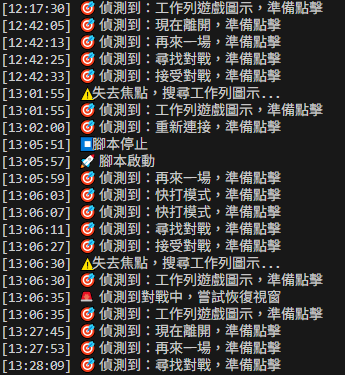
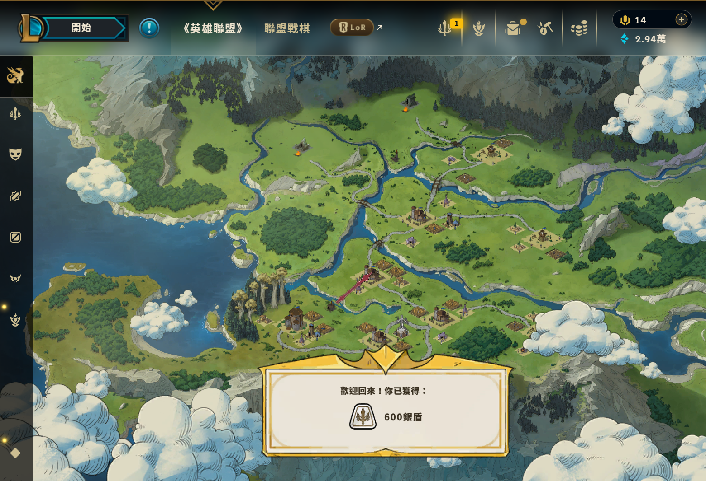

```markdown
# TFT Silver Shield Farmer (TFT 自動戰棋掛機腳本)


-green)

## ⚠️ 免責聲明與道德規範 (Disclaimer)

> **請先閱讀此處**
>
> 作為一名熱愛遊戲的開發者，**我對破壞遊戲公平性的「外掛」（如：自動瞄準、透視、腳本走位、封包攔截）深惡痛絕。** > 
> **本專案性質：**
> * **非入侵式**：本腳本僅利用圖像識別技術，模擬人類的手指點擊滑鼠和鍵盤。**不讀取記憶體、不修改代碼、不攔截封包**。
> * **無害性**：此腳本僅用於《聯盟戰棋 (TFT)》模式。由於執行的是「隨機操作」，在遊戲中實質上是送分給對手，**不會對他人的遊戲體驗造成任何惡意干擾**。
> * **目的**：僅為應對 2026 年官方推出的「遊玩時間換取資源（銀盾）」機制，釋放玩家不必要的垃圾時間。

---

## 📖 專案背景 (Background)

**時間：2026 年初**

《英雄聯盟》引入了全新的 **「銀盾 (Silver Shield)」** 機制，玩家必須累積大量的「實際遊玩時間」才能解鎖稀缺資源。
為了不將人生浪費在重複的對局累積上，我開發了這個 Python 自動化腳本。它能引導電腦自行完成：**配對 -> 接受 -> 遊戲內防呆 -> 結算 -> 再來一場** 的無限循環。

---

## 🏆 實戰成果 (Results)

**"A Happy Afternoon = 600 Shields"**

這是我在某個下午開啟腳本後，出門享受生活的回報。腳本穩定運行數小時，自動處理了斷線、排隊與結算流程。

### 1. 執行紀錄 (Command Line Interface)
終端機即時顯示目前的狀態（尋找中、遊戲中、重連中），並記錄每一次的模擬點擊操作。



### 2. 收穫展示 (Rewards)
透過自動化掛機，輕鬆達成官方要求的遊玩時數，獲取大量銀盾資源。



---

## 🛠️ 功能特色 (Features)

* **智慧影像辨識 (Smart Detection)**
    * 捨棄傳統固定座標，採用 PyAutoGUI + OpenCV 即時比對螢幕畫面。
    * 無論視窗位置如何移動，只要出現「接受」或「尋找對戰」按鈕，皆可精準識別。

* **模擬真人防呆 (Human-like Behavior)**
    * **隨機延遲**：點擊之間加入隨機秒數等待。
    * **隨機操作**：遊戲中會控制滑鼠隨機移動，並按下隨機鍵盤指令（如 E 鍵），模擬輕度活躍狀態以符合獎勵資格。

* **例外處理 (Exception Handling)**
    * **斷線重連**：偵測到 reconnect.png 自動重連。
    * **卡住排除**：結算畫面若卡住，自動識別 skip.png 跳過。
    * **焦點遺失**：自動搜尋工作列圖示，將遊戲視窗拉回最上層。

---

## 🔧 技術實作 (Tech Stack)

* **Python 3**: 核心語言
* **PyAutoGUI**: 螢幕截圖與基本控制
* **PyDirectInput**: 發送 DirectX 層級的鍵鼠訊號 (繞過全螢幕遊戲的屏蔽)
* **OpenCV (cv2)**: 高效影像比對算法
* **Tkinter**: 簡易圖形控制介面 (GUI)
* **Threading**: 多執行緒背景監控

---

## 🚀 使用說明 (How to Run)

### 1. 環境準備
* 建議螢幕解析度：**1920x1080**
* 遊戲顯示模式：**無邊框 (Borderless)**

### 2. 安裝依賴
請確保已安裝 Python 3，並執行以下指令：
bash
pip install -r requirements.txt


### 3. 設定圖片路徑

打開 `src/main.py`，修改圖片庫的路徑：

python
# 請修改為你的實際路徑
PATH = r'C:\Your_Project_Path\assets' 


### 4. 執行腳本

bash
python src/main.py


點擊介面上的 **「開始掛機」** 即可。
(緊急停止：請將滑鼠快速滑至螢幕四個角落之一)

---

## 📂 檔案結構

text
TFT-Reward-Farmer/
├── assets/                  # 辨識圖片庫 (Do Not Rename)
├── docs/
│   └── images/              # 成果展示圖
│       ├── cli_running_log.png
│       └── rewards_proof_600.png
├── src/
│   └── main.py              # 主程式
├── requirements.txt         # 依賴套件列表
└── README.md                # 本說明文件


---